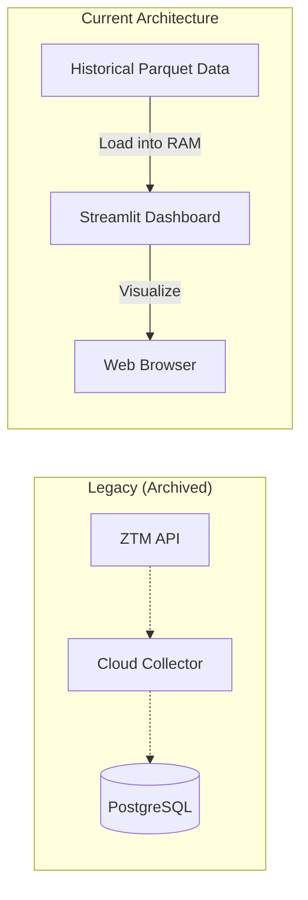

# 🚌 Gdańsk Data Engine

[](https://www.python.org/)
[](https://streamlit.io/)
[](https://cloud.google.com/)
[](https://neon.tech/)
[](https://opensource.org/licenses/MIT)

> **A robust data engineering project for geospatial analysis of public transport in Gdańsk. Migrated from a live cloud ETL pipeline to a high-performance static analysis platform.**

## 🟢 Live Dashboard
Explore the historical traffic analysis here:  
👉 **[Gdansk Traffic Dashboard](https://gdansk-data-engine.streamlit.app/)**

---

## 📖 Table of Contents
1. [Project Overview](#-project-overview)
2. [Engineering Journey (The Pivot)](#-engineering-journey-the-pivot)
3. [Architecture](#-architecture)
4. [Key Features](#-key-features)
5. [How to Run (Simplest Method)](#-how-to-run-simplest-method)
6. [Project Structure](#-project-structure)

---

## 🎯 Project Overview
This project analyzes GPS data from **public transport vehicles** (buses & trams) in Gdańsk. Originally designed as a real-time monitoring system, it has been re-architected into a static analysis tool powered by a large historical dataset (~600k records).

**Goal:** Identify city-wide traffic bottlenecks, analyze schedule adherence, and visualize transport density.

---

## 🌱 Engineering Journey (The Pivot)
This project is a perfect example of architectural evolution based on constraints and optimization.

### Phase 1: Local Containerization (Docker) 🐳
* **Setup:** Python scripts + PostgreSQL hosted locally via Docker Compose.
* **Limitation:** Data collection depended on my local machine being online.

### Phase 2: Cloud Migration (GCP + Neon) ☁️
* **Setup:** Migrated the database to **Serverless PostgreSQL (Neon)** and deployed the ETL collector to a **Google Cloud VM** (Cron job).
* **Success:** Achieved 24/7 autonomous data collection.

### Phase 3: Optimization & Static Analysis (Current) ⚡
* **Challenge:** Cloud database limits and network latency for large datasets.
* **Solution:** * Performed a "Data Dump" of ~600,000 records from the cloud DB.
    * Converted data to **Parquet** format for 100x faster loading times compared to SQL queries.
    * Refactored the dashboard to run in "Offline Mode", removing external dependencies.
* **Result:** A lightning-fast, zero-cost, and reliable dashboard.

---

## ⚙️ Architecture (Current State)



---

## 📊 Key Features

### 1. Interactive Hybrid Map
* **Heatmap Mode:** Visualizes traffic density across the entire city based on historical accumulation.
* **Marker Mode:** Inspect specific vehicle positions and delays at recorded timestamps.

### 2. Deep Dive Analytics
* **Performance:** Uses `pandas` and `pyarrow` to process hundreds of thousands of rows in milliseconds.
* **Filtering:** Filter data by specific lines (e.g., "162", "N1") or time of day.

---

## 🚀 How to Run (Simplest Method)

Since the project is now self-contained (no database required), running it is extremely simple.

### Prerequisites
* Python 3.8+
* Git

### Installation Steps

1. **Clone the repository:**
   ```bash
   git clone [https://github.com/Kajtek_47/gdansk-data-engine.git](https://github.com/Kajtek_47/gdansk-data-engine.git)
   cd gdansk-data-engine
   ```

2. **Set up Virtual Environment:**
   ```bash
   # Windows
   python -m venv venv
   .\venv\Scripts\activate

   # macOS / Linux
   python3 -m venv venv
   source venv/bin/activate
   ```

3. **Install dependencies:**
   ```bash
   pip install -r requirements.txt
   ```

4. **Run the Dashboard:**
   ```bash
   streamlit run src/dashboard.py
   ```
   *The app will launch immediately using the local dataset.*

---

## 📂 Project Structure

```text
gdansk-data-engine/
├── archive/              # Legacy Cloud/ETL scripts (Reference)
│   ├── cloud_collector.py
│   ├── connection.py
│   ├── loader.py
│   └── ...
├── data/                 # Static Datasets
│   └── gdansk_traffic_history.parquet
├── sql/                  # Database schemas (Reference)
│   └── create_table.sql
├── src/                  # Active Application Logic
│   ├── dashboard.py      # Main Streamlit App
│   ├── map_generator.py  # Map rendering logic
│   ├── visualizer.py     # Charts logic
│   └── export_data.py    # Utility to dump SQL to Parquet
├── .gitignore
├── docker-compose.yml    # (Legacy) Docker configuration
├── main.py               # (Legacy) Local runner
├── requirements.txt
└── README.md
