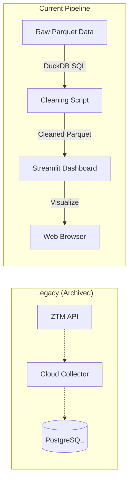

# 🚌 Gdańsk Data Engine

> **A high-performance geospatial analysis platform for public transport in Gdańsk. Transformed from a live ETL pipeline into an optimized static analysis engine using DuckDB and Parquet.**

## 🟢 Live Dashboard
Explore the historical traffic analysis here:  
👉 **[Gdansk Traffic Dashboard](https://gdansk-data-engine.streamlit.app/)**

---

## 📖 Table of Contents
1. [Project Overview](#-project-overview)
2. [Engineering Journey (The Pivot)](#-engineering-journey-the-pivot)
3. [Data Engineering & Cleaning (SQL)](#-data-engineering--cleaning-sql)
4. [Architecture](#-architecture)
5. [How to Run](#-how-to-run)
6. [Project Structure](#-project-structure)

---

## 🎯 Project Overview
This project analyzes GPS data from **public transport vehicles** (buses & trams) in Gdańsk to identify traffic bottlenecks and schedule adherence. 

Originally designed as a real-time monitoring system, it was re-architected into a **Static Analysis Platform** to handle large historical datasets (~600k records) with sub-second query performance using **Columnar Storage (Parquet)** and **OLAP SQL (DuckDB)**.

---

## 🌱 Engineering Journey (The Pivot)
This project is a story of architectural evolution based on performance constraints and cost optimization.

### Phase 1: Local Containerization 🐳
* **Stack:** Python scripts + PostgreSQL (Docker Compose).
* **Limitation:** Data collection was tied to local machine availability.

### Phase 2: Cloud Migration (GCP + Neon) ☁️
* **Stack:** Google Cloud VM (ETL Script) + Serverless PostgreSQL (Neon).
* **Success:** Achieved 24/7 autonomous data collection.
* **Bottleneck:** Cloud database limits (Egress) and latency when querying large historical datasets for visualization.

### Phase 3: Optimization & Static Analysis⚡
* **Challenge:** Cloud database limits and network latency for large datasets.
* **Solution:** Performed a "Data Dump" of ~600,000 records from the cloud DB.
    * Converted data to **Parquet** format for 100x faster loading times compared to SQL queries.
    * Refactored the dashboard to run in "Offline Mode", removing external dependencies.
* **Result:** A lightning-fast, zero-cost, and reliable dashboard.

### Phase 4: Data cleaning and improving the dashboard (still in progress)
* **Challenge:** Delay anomalies present in the data.
* **Solution:**  Implemented **DuckDB** for complex SQL transformations on files.
    * Anomalies detected and removed.
    * Saved cleaned data to another parquet file.
* **In work:** Detecting more misleading data and improving data quality even more.

---

## 🧹 Data Engineering & Cleaning (SQL)
Raw GPS data from public APIs is often noisy. I implemented an advanced **SQL Data Cleaning Pipeline** using **DuckDB** to sanitize the dataset.

**Key Anomalies Detected & Removed:**
1.  **Ghost Buses (Linear Delay Growth):** * *Problem:* Vehicles standing still (e.g., at a depot) while their delay counter increased linearly with time.
    * *Solution:* Used SQL **Window Functions** (`LAG`, `LEAD`) to calculate delta metrics. If `distance < 30m` AND `delay_diff ≈ time_diff`, the record is flagged as a system artifact.
2.  **Stagnant Peaks:**
    * *Problem:* Extreme delay values (e.g., 18,000s) persisting after a "Ghost Bus" stopped incrementing.
    * *Solution:* Logic to remove high-delay outliers that show zero movement over time.
3.  **Impossible Physics:**
    * *Problem:* GPS drift causing "teleportation".
    * *Solution:* Calculated velocity between points; removed records implying speeds > 200 km/h.

**Tech Used:** `Common Table Expressions (CTEs)`, `Window Functions`, `Spatial Distance Calculation (Haversine approx)`.

---

## ⚙️ Architecture

---

## 🚀 How to Run

### Prerequisites

-   Python 3.8+
    
-   Git
    

### Installation

1.  **Clone the repository:**
    
    Bash
    
        git clone [https://github.com/Kajtek_47/gdansk-data-engine.git](https://github.com/Kajtek_47/gdansk-data-engine.git)
        cd gdansk-data-engine
    
2.  **Install dependencies:**
    
    Bash
    
        pip install -r requirements.txt
    
3.  **Run the Dashboard:**
    
    Bash
    
        streamlit run src/dashboard.py
    

_(Optional)_ **Re-run Data Cleaning:**
If you want to modify the cleaning logic, edit `src/clean_data.py` and run:

Bash

    python src/clean_data.py

* * *

## 📂 Project Structure

    gdansk-data-engine/
    ├── archive/              # 🏛️ Legacy Cloud/ETL scripts (Reference)
    ├── data/                 # 💾 Data Storage
    │   ├── gdansk_traffic_history.parquet         # Raw Dataset
    │   └── gdansk_traffic_history_cleaned.parquet # Processed Dataset (DuckDB output)
    ├── src/                  # 🧠 Source Code
    │   ├── clean_data.py     # Advanced SQL Cleaning Logic (DuckDB)
    │   ├── dashboard.py      # Main Streamlit App
    │   ├── export_data.py    # Script Exporting Data From Cloud to Parquet
    │   ├── map_generator.py  # Folium Map Logic
    │   └── visualizer.py     # Plotly Charts Logic
    ├── requirements.txt
    └── README.md