# 🚌 Gdańsk Data Engine

[](https://www.python.org/)
[](https://streamlit.io/)
[](https://cloud.google.com/)
[](https://neon.tech/)
[](https://opensource.org/licenses/MIT)

> **A robust, cloud-native ETL pipeline for real-time monitoring and geospatial analysis of public transport delays in Gdańsk.**

## 🟢 Live Demo
Check out the live dashboard deployed on Streamlit Cloud:  
👉 **[Gdansk Traffic Dashboard](https://gdansk-data-engine.streamlit.app/)** *(Note: Initial loading might take a few seconds as it connects to the serverless database)*

---

## 📖 Table of Contents
1. [Project Overview](#-project-overview)
2. [Engineering Journey (Evolution)](#-engineering-journey-development-journey)
3. [System Architecture](#-system-architecture)
4. [Tech Stack](#-tech-stack)
5. [Key Features](#-key-features)
6. [How to Run (Local Development)](#-how-to-run-local-development)
7. [Project Structure](#-project-structure)

---

## 🎯 Project Overview
This project implements an automated **ETL (Extract, Transform, Load)** system that ingests GPS data from **all public transport vehicles** (buses & trams) in Gdańsk. The goal is to archive historical movement data to identify city-wide traffic bottlenecks and analyze schedule adherence in real-time.

---

## 🌱 Engineering Journey (Development Journey)
This project evolved from a local experiment to a fully automated cloud solution. Here is how the architecture changed over time:

### Phase 1: Local Containerization (Docker) 🐳
* **Initial Setup:** The project started as a local Python script running on my laptop.
* **Storage:** I used **Docker & Docker Compose** to host a local PostgreSQL instance.
* **Limitation:** The data collection stopped whenever I turned off my computer, creating gaps in the dataset.

### Phase 2: Visualization Prototype 📊
* **Focus:** Moved from raw data analysis to visual storytelling.
* **Development:** Created isolated scripts to generate static maps (Folium) and charts (Plotly).
* **Integration:** Combined these components into a unified interactive dashboard using **Streamlit**.

### Phase 3: Cloud Migration (Current State) ☁️
* **Goal:** 24/7 Data Collection & Global Accessibility.
* **Action:**
    * Migrated the database to **Neon (Serverless PostgreSQL)** to remove local dependencies.
    * Deployed the ETL script to a **Google Cloud Platform (VM)** instance with Crontab for continuous execution.
    * Deployed the frontend to **Streamlit Community Cloud**.
* **Result:** A fully autonomous system that requires zero local maintenance.

---

## ⚙️ System Architecture

The pipeline follows a classic **ETL** pattern optimized for cloud execution.

```mermaid
graph TD
    subgraph "Data Source"
        API[Open Gdańsk API]
    end

    subgraph "Google Cloud Platform (VM)"
        ETL[Python ETL Script]
        CRON[Linux Cron Daemon]
        CRON -->|Trigger every 5 min| ETL
    end

    subgraph "Storage & Cloud"
        DB[(Neon Serverless Postgres)]
        CLOUD[Streamlit Cloud]
    end

    subgraph "End User"
        UI[Interactive Dashboard]
    end

    API -->|JSON Response| ETL
    ETL -->|Cleaning & Transformation| ETL
    ETL -->|Batch Insert| DB
    DB <-->|Read Historical Data| CLOUD
    CLOUD -->|Render Maps & Charts| UI
```



1.  **Extract:** A lightweight Python script fetches JSON data from the ZTM API.
2.  **Transform:** Data is cleaned, timestamps are standardized to UTC, and delay metrics are calculated.
3.  **Load:** Data is pushed to the remote Neon PostgreSQL database.
4.  **Analyze:** Streamlit fetches aggregated data to render interactive visualizations.

---

## 🛠 Tech Stack

| Category | Technologies |
| :--- | :--- |
| **Infrastructure** | Google Cloud Platform (Compute Engine), Linux (Ubuntu) |
| **Database** | Neon (Serverless PostgreSQL), SQL |
| **Backend Core** | Python 3.10, `requests`, `pandas` |
| **Data Engineering** | Crontab (Automation), `psycopg2` (DB connector) |
| **Visualization** | Streamlit, Folium (Maps), Plotly Express (Charts) |

---

## 📊 Key Features

### 1. Interactive Hybrid Map
* **Heatmap Mode:** Visualizes traffic density and high-delay zones across the entire city.
* **Marker Mode:** Allows zooming in to see specific vehicle IDs and exact delay in minutes.

### 2. Live Analytics
* **KPI Monitors:** Real-time counter of active buses/trams and average network delay.
* **Line Inspection:** Dropdown menu to filter map and data by specific bus lines (e.g., "162", "N1").

### 3. Historical Data Access
* The system retains historical data, allowing for "playback" of traffic conditions from previous days (implemented via SQL time-window queries).

---

## 🚀 How to Run (Local Development)

Follow these steps to set up the project locally for development or testing.

### Prerequisites
* **Python 3.8+** installed on your machine.
* **Git** version control.
* **PostgreSQL Database:** You need access to a Postgres instance (Local or Cloud).

### Installation Guide

#### 1. Clone the Repository
```bash
git clone https://github.com/Kajtek_47/gdansk-data-engine.git
cd gdansk-data-engine
```

#### 2. Set Up Virtual Environment
**Windows:**
```bash
python -m venv venv
.\venv\Scripts\activate
```
**macOS / Linux:**
```bash
python3 -m venv venv
source venv/bin/activate
```

#### 3. Install Python Dependencies
```bash
pip install -r requirements.txt
```

#### 4. Configure Environment Variables
Create a file named `.env` in the root directory. Add your database credentials:

```ini
DB_HOST=your-database-host (e.g., ep-cold-tooth.aws.neon.tech)
DB_NAME=your_database_name
DB_USER=your_username
DB_PASSWORD=your_password
```

#### 5. Database Initialization
If you are using a new/empty database, you must create the required tables. Run the provided SQL script using your preferred SQL client (e.g., DBeaver) or terminal:

```sql
-- Run the content of sql/create_table.sql
CREATE TABLE IF NOT EXISTS vehicles (...);
```

#### 6. Start Data Collection (Crucial Step!)
Your new database is empty. To see anything on the dashboard, you must fetch some data first. Run the collector manually:

```bash
python main.py
```
*Let this run for a moment to populate the database with current traffic data.*

#### 7. Launch the Dashboard
```bash
streamlit run src/dashboard.py
```

---

## 📂 Project Structure

```text
gdansk-data-engine/
├── .github/workflows/    # CI/CD configurations
├── sql/
│   └── create_table.sql  # Database initialization schema
├── src/
│   ├── cloud_collector.py # Main ETL script running on Cloud VM
│   ├── connection.py     # Database connection logic
│   ├── dashboard.py      # Main entry point for Streamlit App
│   ├── extractor.py      # Module for API data fetching
│   ├── init_cloud_db.py  # Utility to initialize cloud DB
│   ├── loader.py         # Module for loading data to DB
│   ├── map_generator.py  # Logic for generating Folium maps
│   └── visualizer.py     # Logic for generating charts
├── .gitignore
├── bottlenecks_map.html  # Generated static map artifact
├── docker-compose.yml    # Legacy Docker configuration
├── main.py               # Local execution entry point
├── requirements.txt      # Python dependencies
├── README.md             # Project documentation
└── .env                  # Secrets (Not committed to repo)
```